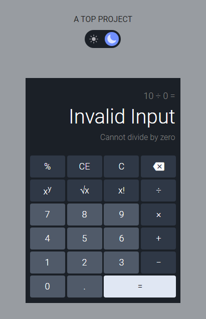

# Calculator

A working on-screen calculator for the four basic operations. Built with HTML, CSS and JavaScript.

Part of [The Odin Project](https://www.theodinproject.com/) (Foundations course) · [project lesson](https://www.theodinproject.com/lessons/foundations-calculator)

Built August 2023.

