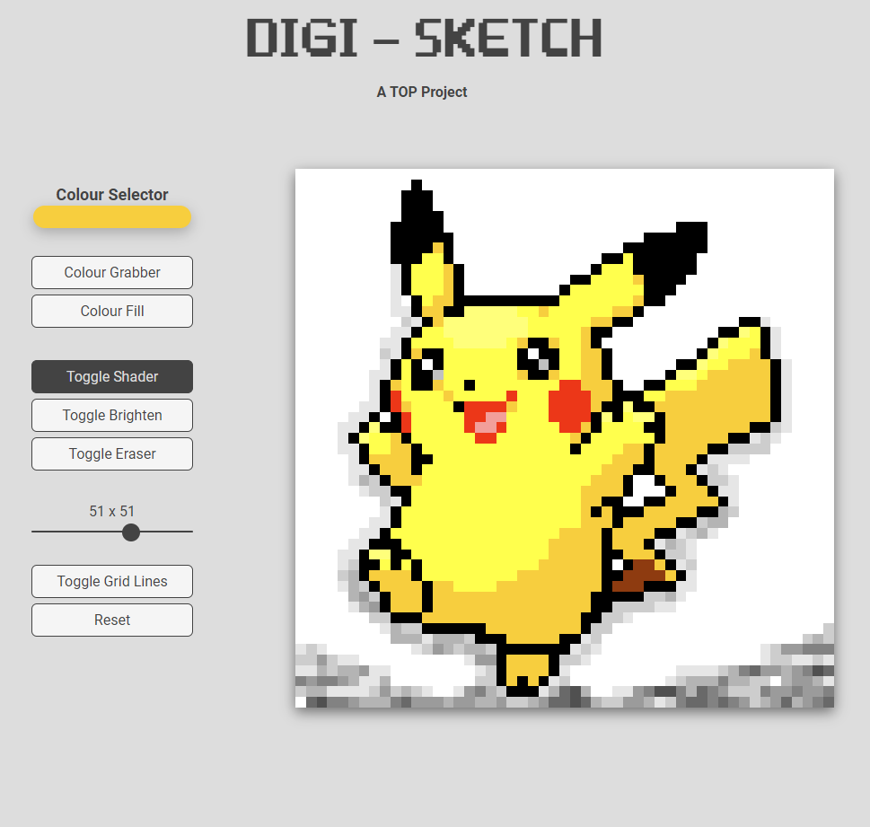

# Etch-a-Sketch

A browser drawing pad on a configurable grid — drag across the cells to draw. Built with HTML, CSS and JavaScript.

Part of [The Odin Project](https://www.theodinproject.com/) (Foundations course) · [project lesson](https://www.theodinproject.com/lessons/foundations-etch-a-sketch)

Built July–August 2023.

