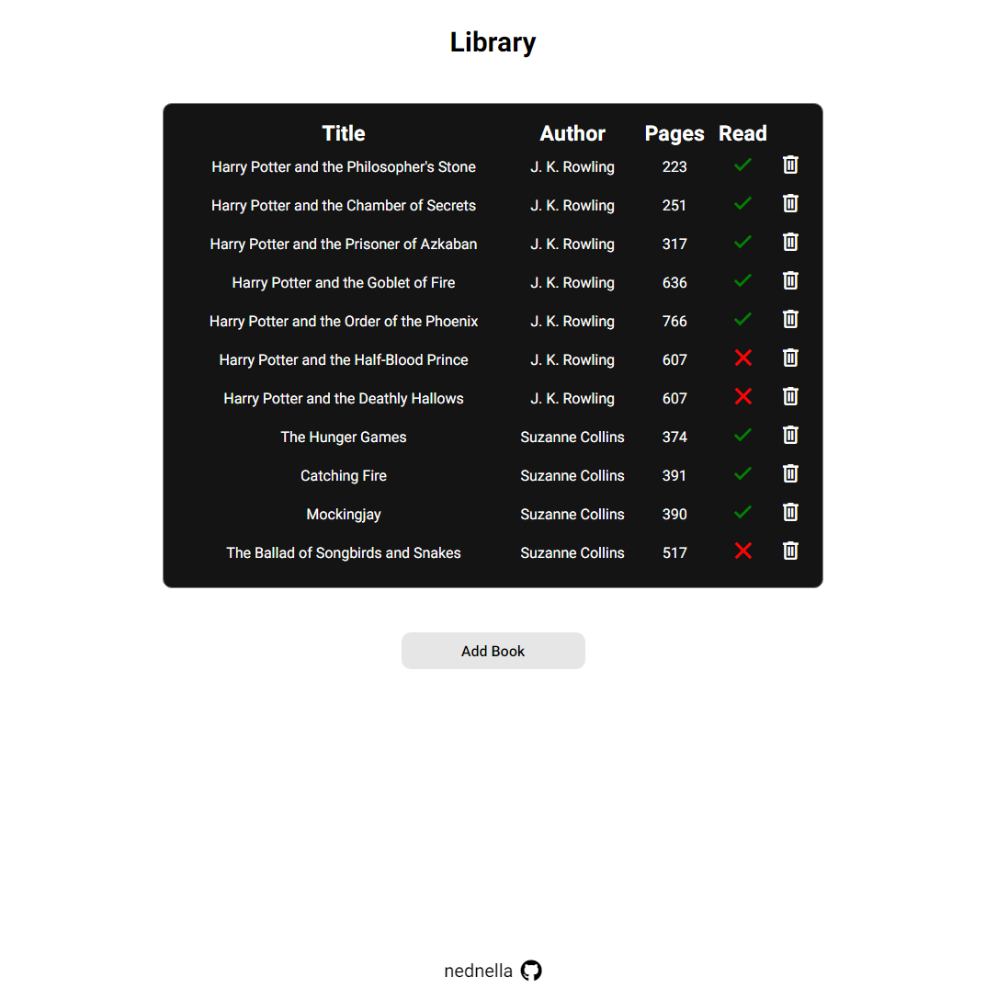

# Library

A small app for keeping track of books and whether you've read them. Built with HTML, CSS and JavaScript.

Part of [The Odin Project](https://www.theodinproject.com/) (JavaScript course) · [project lesson](https://www.theodinproject.com/lessons/node-path-javascript-library)

Built November 2023.

