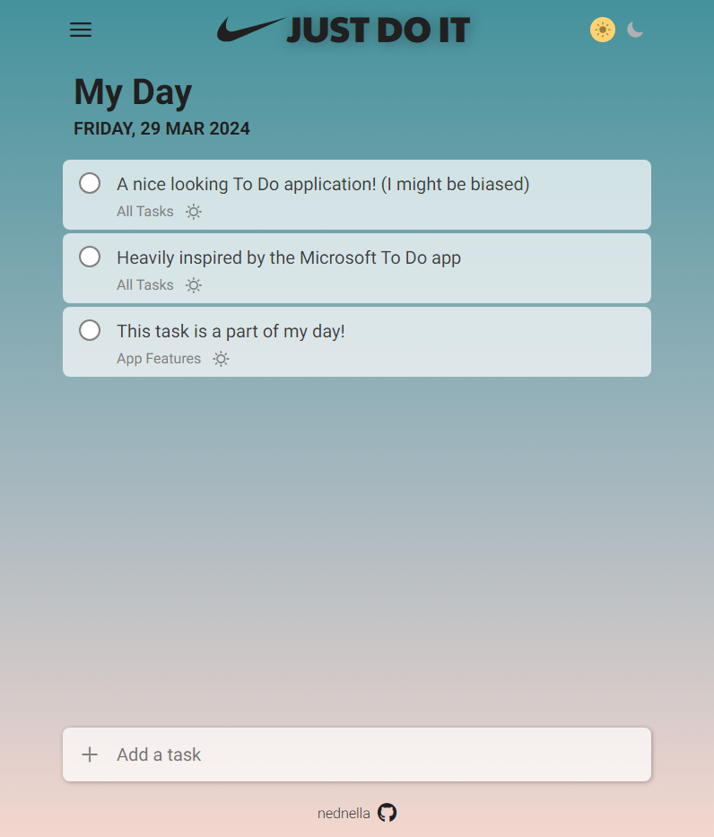

# To-Do List

A to-do app that organises tasks into projects and saves them to localStorage. Built with JavaScript and Sass, bundled with Webpack.

Part of [The Odin Project](https://www.theodinproject.com/) (JavaScript course) · [project lesson](https://www.theodinproject.com/lessons/node-path-javascript-todo-list)

Built February–April 2024.

