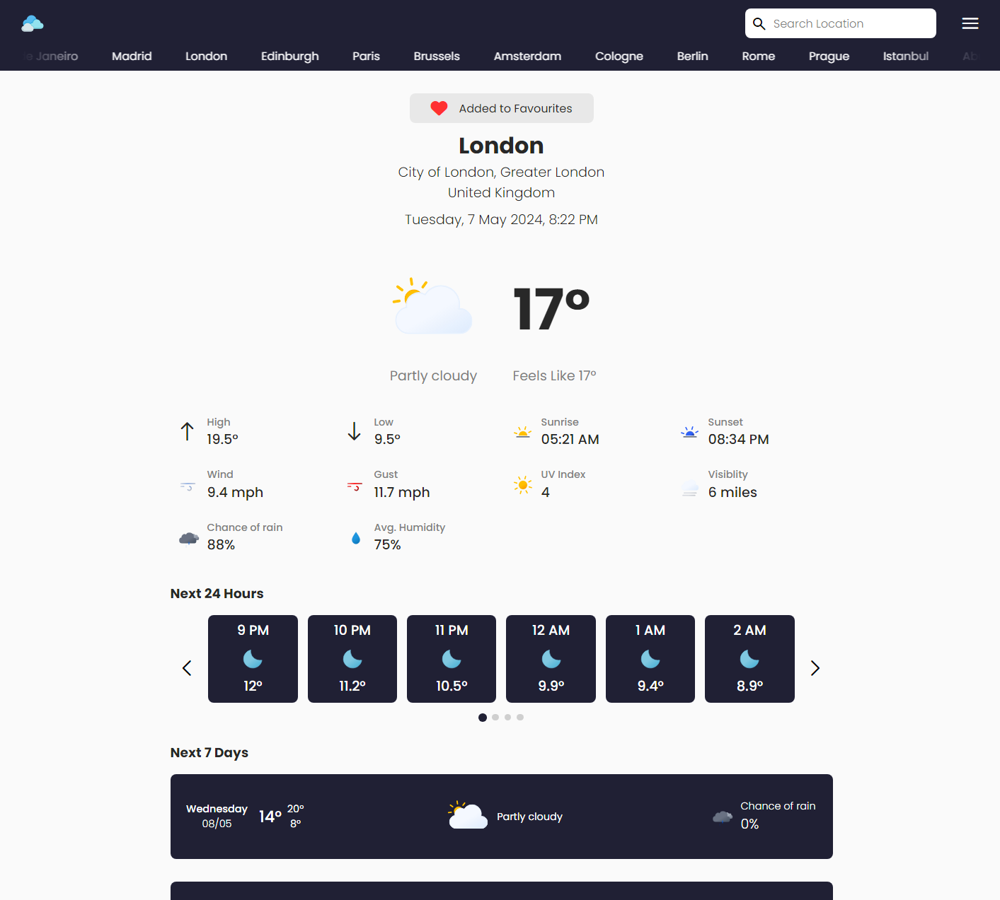

# Weather App

A weather app that pulls live forecasts from a weather API. Built with JavaScript and Sass, bundled with Webpack.

Part of [The Odin Project](https://www.theodinproject.com/) (JavaScript course) · [project lesson](https://www.theodinproject.com/lessons/node-path-javascript-weather-app)

Built April–May 2024.

